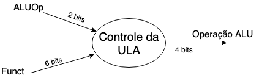

# Elementos de um caminho de dados

O processador possui dois componentes principais: o **caminho de dados** e o **controle**. O caminho de dados é responsável pelas transformações nos bits de entrada executando operações aritméticas para gerar a saída esperada, enquanto o controle diz ao caminho de dados, à memória e aos dispositivos de entrada e saída o que fazer de acordo com cada instrução recebida.

Nosso objetivo, nessa parte, é entender os princípios básicos para o projéto de um caminho de dados para as três classes de instruções MIPS, que são as instruções:

1. Lógicas e Aritméticas (add, sub, and, or e slt)
2. acesso à memória (lw e sw)
3. desvio condicional (beq) e incondicional (j).

Cada classe de instruções necessita de elementos particulares para ser sexecutada.

## Etapa Comum

A primeira etapa no caminho de dados é comum a todas as classes de instruções.

### Buscar na memória uma instrução, dado um endereço

Para executar essa etapa, são necessários 3 elementos:

1. a **memória de isntruções** que, dado um endereço, retorna uma instrução.
2. o **contador de programa (PC)**, que contém o endereço que a instrução atual ocupa na memória.
3. O somador, que é usado para incrementar o PC e fazê-lo apntar para a próxima instrução.

Essa etapa consiste em:

1. Buscar ainstrução na memória, cujo endereço está no PC,
2. incrementar o PC em **4 bytes** para apontar para a próxima instrução.

Os 3 elementos são combinados para executar essa etapa.

    4 = 4 bytes

PC aponta um endereço que vai somando de 4 em 4 bytes e a memória recebe o endereço da instrução e manda a instrução.

## Instruções lógicas e aritméticas

São instruções do tipo: add t0, t1, t2.

Seguem as seguintes etapas:

1. Leem o valor de dois registrador
2. realizam uma operação aritmética com o conteúdo dos registradores lidos e
3. escrevem o resultado num registrador

As etapas 1 e 3 usam-se de uma estrutura chamada banco de registradores, que é uma coleção de registradores que realiza leitura e escrita a partir de um número que identifica o registrador.

O objetivo do banco de registradores é receber o identificador do registrador de leitura ou escrita e escrever um dado ou retornar dados lidos.

Escreve = 0, não há dado. 1, há dado.

Para distinguir entre leitura e escrita, o banco de registradores conta com um sinal de controle que indica que os dados estão prontos para serem escritos, e a escrita é feita numa transição do clock. Isso significa que o banco de registradores pode ler e escrever ao mesmo tempo num ciclo de clock: a leitura obtém o valor escrito no clock anterior e a escrita será feita na transição de clock subsequente. Isso permite operações do tipo

    add t0, t0, t1

Outro elemento necessário para esta classe de instruções é a unidade lógica e aritmética. A ULA deve receber duas palavras de 32 bits e uma flag de controle, de 4 bits, que identifica a operação. A saída é uma palavra de 32 bits e um sinal de controle que será 1 caso a saída seja zero.

## Instruções de acesso à memória

Consideremos as instruções:

* lw reg, offset(base)
* sw reg, offset(base)

Essas instruções seguem o formato do tipo I

| op | rs | rt | Endereço |
|----|----|----|----|
|6 bits|5 bits|5 bits |16 bits|

e operam da seguinte forma:

* 1.calculam um endereço de memória, como: base + offset
* 2.1 lê um dado de um registrador e armazena na memória no endereço calculado em 1 ou 
* 2.2 lê um dado da memória no endereço calculado e armazena num registrador.

A etapa 1 faz usa da ULA e as etapas 2.1 e 2.2 fazem uso do banco de registradores, ambos como projetados para instruções lógicas e aritméticas.

Ainda se faz necessário uma unidade de extensão de sinal, que expande a constante de 16 bits para 32 bits.
Além disso, é necessário o projeto de uma unidade de memória de dados que leia ou escreva dados num endereço. Por ter operações de leitura e escrita, a memória de dados possui sinais de controle separados para leitura e escrita, embora apenas um seja ativado por ciclo de clock.

### "Dado um endereço, você quer ler ou escrever um dado."
### "Se for pra escrever: escrita = 1 e leitura = 0. Se for para ler: leitura = 1 e escrita = 0."

## Instruções de desvio

Considerando a instrução *beq*. Essa instrução possuí três operandos: dois registradores cujo valores devem ser comparados por igualdade, e um offset de 16 bits. Esse offset é usado para calcular o endereço de destino do desvio, que nada mais é que o endereço de memória da instrução para a qual o fluxo deve ser desviado.
Há duas sutilezas das instruções de desvio que devem ser destacadas:

1. o endereço base para o cálculo do endereço de destino é o PC + 4;
2. o offset é representado em unidades da memória, não em bytes. Por isso, deve ser deslocado dois bits para a esquerda 
antes de ser utilizado para calcular o endereço de destino de desvio.

Portanto, os elementos do caminho de dados devem ser capazes de somar e fazer deslocamentos.

Além disso, é preciso decidir se a próxima instrução será a instrução seguinte ou a instrução do endereço de destino do desvio. Isso é baseado na comparação: se for verdadeira, PC recebe o endereço de destino do desvio, e dizemos que o desvio é tomado. Caso contrário, apenas soma-se 4 ao PC e o desvio é não-tomado.
Desta forma, instruções de desvio devem:

1. calcular o endereço de desvio; 
2. comparar o conteúdo de desvio;
3. definir o PC;

Para realizar a comparação entre dois registradores, utiliza-se uma ULA que faça uma subtração entre os valores: se o sinal de controle da ULA que indica zero estiver ativo no resultado, então os registradores possuem valores iguais.

Os elementos do caminho de dados para desvio condicional estão no Slide 1.

    beq reg1,reg2,label , onde label é o offset
    offset <--- PC

    Endereço de destino do desvio = (PC + 4) + (4 * offset) (4 * offset) = shift à esquerda 2 vezes no offset

## Um caminho de dados unindo as 3 classes

Para unir as 3 classes de instrução em um único caminho de dados, devemos observar as semelhanças e diferenças entre elas

As operações diferem em:

1. As instruções lógicas e aritméticas utilizam a ULA com entradas vindas dos registradores, enquanto as de acesso à memória e desvio condicional recebem um dos dados vindos do extensor de sinal
2. O valor armazenado de um registrador de destino vem da ULA, para instruções do tipo K, ou da memória, para lw.

### Exemplos

1.

    add $t0, $t1, $t2
             ---|--- operandos, ambos registradores

    lw 4t0, 24($t2)
            ---|--- operandos, constante e registrador

2.

    add $t0, $t1, $t2
        -|- a operação é feita na ULA e depois deve ser armazenada no registrador

    lw $t0, 24($t2)
        |-> o dado a ser armazenado vem da memória

O caminho de dados para as três classes de instruções, com excessão da **beq**, pode ser visto no Slide 2, enquanto o caminho completo, inclusive para a beq, pode ser visto no Slide 3.

## Implementação Monociclo

A implementação mais simples para o caminho de dados visto consistem em desemvolver uma unidade de controle do caminho de dados. Esse projeto deve garantir que todas as instruções sejam executadas um um único ciclo de clock com período fixo. Por isso, essa implementação é **monociclo**.

Dois controladores são necessários:

1. controlador da ULA e
2. Controlador Central.

### Controlador da ULA

A ULA é usada pelas 3 classes de instruções

1. Para as lógicas e aritméticas, é utilizada para executar a operação objetivo da instrução
2. Para instruções de acesso à memória, é usada para calcular o endereço de interesse da memória de dados
3. para **beq**, é usada para comparar os operandos.

Para definir qual operação deve ser efetuada, a ideia é usar um controlador da forma:

onde **func** é o campo que identifica uma instrução no formato do tipo R e ALUOp é um sinal de controle de 2 bits definido tal que:

**00** identifica **add** em instrução de acesso à memória,

**01** identifica **sub** em beq e 

**10** identifica instruções do tipo R.

Os bits do sinal ALUOp são definidos pelo controlador principal com base na instrução a ser executada. Detalhes sobre o projeto do controlador da ULA podem ser vistos nos slides 4 e 6.

### Controlador Principal

A primeira parte do controlador principal constiste em dividir a instrução a ser executada em partes distribuídas adequadamente pelo caminho de dados. Para cada classe de instrução, consideraremos a seguinte divisão:

1. Instruções lógicas e aritméticas

    | op | rs | rt | rd | shamt | funct|
    |----|----|----|----|---|---|
    |31:26|25:21|20:16|15:11|10:6|5:0|

2. Instruções de acesso à memória

    | op | rs | rt | Endereço |
    |----|----|----|----|
    |31:26|25:21|20:16|15:0|

3. instruções de Desvio

    | op | rs | rt | Endereço |
    |----|----|----|----|
    |31:26|25:21|20:16|15:0|

As instruções assim divididas seguem os seguintes padrões:

* O campo *op* está sempre nas posições 31:26. Em alguns lugares, chamaremos de Op[5:0].
* Para as instruções *lw* e *sw*:
    * **rs** é o **endereço base** e sempre ocupa as posições 25:21
    * **rt** é a origem (para sw) ou destido (para *lw*) e sempre ocupa as posições 20:16
* Os registradores de leitura estão sempre nas posicões 25:21 e 20:16
* O *offset* para *beq*, *lw* e *sw* sempre ocupa as posições 15:0
* O registrador de destino pode ser o *rd* (para instruções do tipo R) ou *rt* (para *lw*)

Como há 2 opções para o registrador de destino, um multiplexador é utilizado para indicar qual será a parte da instrução que o contém. Colocando tudo isso junto, chegamos à estrutura ilustrada no slide 7.

Resumindo, temos agora 9 sinais de controle.

1. **Regdst**: 0, se o registrador de destido é *rt*, 1 se for *rd*,
2. **RegWrite**: 1 se houver dados a serem escritos na transição de clock no banco de registradores.
3. **ALUSrc**: 0 se um dos operandos da ALU vem do banco de registradores, 1 se vem com constante do extensor de sinal,
4. **MomWrite**: 1 se há dado para ser escrito na memória de dados,
5. **MemRead**: 1 se há dado lido na memória de dados,
6. **MemtoReg**: 0 quando o valor a ser escrito no banco de regisrtradores vem da ULA ou 1 quando vem da memória de dados.
7. **PCSrc** 0 se PC = PC+4 ou 1 se PC = endereço de destino do desvio.
8. e 9. **ALUOp**: identificador de operação da ULA.

### Exemplos

1. 
