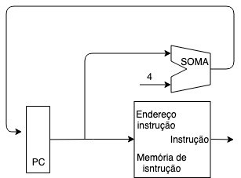

# Desempenho

Pensamos em desempenho quando estamos interessados em classificar algo do melhor para o pior. Em computação, analizamos desempenho entre diversas arquiteturas.
Há dois fatores principais que determinam a qualidade de um computador.

1. O tempo de resposta, também chamado de tempo de execução, é o tempo total que o computador demanda para executar determinada tarefa, incluindo tempo de acesso ao disco, à memória, entrada e saída, tempo de CPU e overhead do sistema.
2. A vazão é a qualidade total de trabalho feito num determinado intervalo de tempo.

Em geral, ao melhorar o tempo de execução, melhora-se a vazão, todavia o oposto nem é válido.
De um panorama geral, desempenho é sempre medido com relação ao tempo: quanto menor o tempo, maior o desempenho. Portanto, tempo e desempenho são grandezas inversamentes proporcionais, ou seja:

    Desempenho = 1/Tempo de Execução

Quando dizemos que um computadir X é n vezes mais rápido que um computador Y, estamos querendo dizer que:

    DesempenhoX/DesempenhoY = n

Neste contexto, se X é n vezes mais rápido que Y, então o tempo de execução de Y é n vezes maior que o de X, isto é,
    
    Tempo de ExecuçãoY/Tempo de ExecuçãoX = n

### Exemplo

Se um computador A executa um programa em 10 segundos e um computador B em 15, o quanto A é mais rápido que B?
Neste caso, de fato, A é mais rápido que B e:

    DesempenhoA/DesempenhoB = TempoB/TempoA = 15/10 = 1,5

O computador A é 1,5 vezes mais rápido que B.

Em muitos casos, também é de interesse o tempo de execução da CPU. Esse é o tempo que a CPU gasta para executar uma tarefa, sem considerar entrada e saída, concorrência do sistema operacional, etc.
Há também o interesse em medidas que reflitam o quão rápido o hardware realiza uma operação.
Quase todos computadores possuem um relógio interno que trabalha com velocidade constante, ou seja, realizam um ciclo de tempo constante. Esses intervalos de um ciclo do relógio são chamados de ciclos de clock. Há duas medidas relacionadas aos ciclos de clock:

1. Periodo de clock, que é o tempo consumido num ciclo de clock.
2. Velocidade do clock, que mede quantos ciclos são realizados numa fração de tempo. Ou seja:

    Período de clock = Tempo / Ciclo e Velocidade de clock = Ciclo / Tempo

O período do clock é geralmente medido em alguma fração do segundo (nano (10ˆ-9), pico (10ˆ-12)).

A velocidade do clock, por sua vez, é medida em alguma unidade de frequência, geralmente Hertz.
Geralmente, do ponto de vista de projeto, analisa-se o tempo de CPU para um determinado programa, já que o tempo de execução depende de outros fatores variáveis.

Usando os elementos vistos até aqui:
    
    Tempo de Execução da CPU para um programa = ciclos de clock da CPU para o programa * Período de clock

    Tempo de Execução da CPU para um programa = ciclos de clock da CPU para o programa / velocidade do clock

### Exemplo

Suponha que um programa é executado num computador A em 10s, e que A possui 4 GHz de clock. Queremos desenvolver um computador que execute o mesmo programa em 6s. O projetista do computador B percebeu que é possível aumentar o clock de B, mas isso implicaria 1.2 mais ciclos de clock que A para B roldar o programa, Que velocidade de clock precisamos em B para Atingir nosso Objetivo?

temos que

    ClockA = 4 GHz

e queremos calcular

    ClockB = x.

além disso,

    CiclosB = 1.2 CiclosA

Logo,

    TempoA = CiclosA / Clock a => 10 = CiclosA / 4x10ˆ9ciclos/seg
    TempoB = CiclosB / Clock b => 6 = 1.2 CiclosA / x

Com isso,

    CiclosA = 4x10ˆ9 ciclos/seg x 10segundos
    = 40x10ˆ9

logo,

    6x = 1,2x40x10ˆ9 => x = 1,2 . 40 . 10ˆ9 / 6
    x = 8 . 10ˆ9 = 8 GHz

Os Ciclos de clock da CPU para um programa pode ser calculado multiplicando-se a quantidade de instruções de um programa
pela média de ciclos de clock por instrução. Essa média é denomiada CPI (Ciclos por Instrução).

Com isso,

    Tempo de execução da qtd de instruções da = Qtd de  x CPI x Período de clock     
    CPU p/ um programa                          Instru.

Ou,

    Tempo = Qtd de instruções x CPI / Vel do Clock

### Exemplo

Suponha que temos 2 computadores que implementam a mesma arquitetura de instruções. O computador A tem um período de clock
de 250ps e um CPI de 2.0 para um determinado programa, e o computador B tem um período de clock de 500 ps e um CPI de 1.2 para o mesmo programa. Qual computador é o mais rápido?

    tempoA = I . 2 . 250ps = 500Ips
    tempoB = I. 1.2 . 500ps = 600Ips

    DesempenhoA / DesempenhoB = TempoB / TempoA = 600I / 500I = 1.2

Portanto, o computador A é 1.2 vezes mais rápido que o computador B.

## Elementos de um caminho de dados

O processador possui dois componentes principais: o *caminho de dados* e o *controle*. O caminho de dados é responsável pelas transformações nos bits de entrada executando operações aritméticas para gerar a saída esperada, enquanto o controle diz ao caminho de dados, à memória e aos dispositivos de entrada e saída o que fazer de acordo com cada instrução recebida.

Nosso objetivo, nessa parte, é entender os princípios básicos para o projéto de um caminho de dados para as três classes de instruções MIPS, que são as instruções:

1. Lógicas e Aritméticas (add, sub, and, or e slt)
2. acesso à memória (lw e sw)
3. desvio condicional (beq) e incondicional (j).

Cada classe de instruções necessita de elementos particulares para ser sexecutada.

## Etapa Comum

A primeira etapa no caminho de dados é comum a todas as classes de instruções.

### Buscar na memória uma instrução, dado um endereço

Para executar essa etapa, são necessários 3 elementos:

1. a *memória de isntruções* que, dado um endereço, retorna uma instrução.
2. o *contador de programa (PC)*, que contém o endereço que a instrução atual ocupa na memória.
3. O somador, que é usado para incrementar o PC e fazê-lo apntar para a próxima instrução.

Essa etapa consiste em:

1. Buscar ainstrução na memória, cujo endereço está no PC,
2. incrementar o PC em *4 bytes* para apontar para a próxima instrução.

Os 3 elementos são combinados para executar essa etapa.

## Instruções lógicas e aritméticas

São instruções do tipo: add t0, t1, t2.

Seguem as seguintes etapas:

1. Leem o valor de dois registrador
2. realizam uma operação aritmética com o conteúdo dos registradores lidos e
3. escrevem o resultado num registrador

As etapas 1 e 3 usam-se de uma estrutura chamada banco de registradores, que é uma coleção de registradores que realiza leitura e escrita a partir de um número que identifica o registrador.

