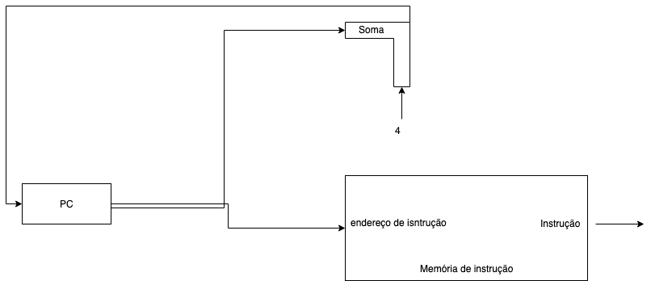

implicaria 1.2 mais ciclos de clock que A para B roldar o programa, Que velocidade de clock precisamos em B para Atingir nosso Objetivo?

temos que

    Clock a = 4 GHz

e queremos calcular

    Clock b = x.

além disso,

    Ciclos b = 1.2 ciclos a

Logo,

    Tempo a = Ciclos a / Clock a => 10 = Ciclos a / 4x10ˆ9ciclos/seg
    Tempo b = Ciclos b / Clock b => 6 = 1.2 ciclos a / x

Com isso,

    Ciclos a = 4x10ˆ9 ciclos/seg x 10segundos
    = 40x10ˆ9

logo,

    6x = 1,2x40x10ˆ9 => x = 1,2 . 40 . 10ˆ9 / 6
    x = 8 . 10ˆ9 = 8 GHz

Os Ciclos de clock da CPU para um programa pode ser calculado multiplicando-se a quantidade de instruções de um programa
pela média de ciclos de clock por instrução. Essa média é denomiada CPI (Ciclos por Instrução).

Com isso,

    Tempo de execução da qtd de instruções da = Qtd de  x CPI x Período de clock     
    CPU p/ um programa                          Instru.

Ou,

    Tempo = Qtd de instruções x CPI / Vel do Clock

### Exemplo

Suponha que temos 2 computadores que implementam a mesma arquitetura de instruções. O computador A tem um período de clock
de 250ps e um CPI de 2.0 para um determinado programa, e o computador B tem um período de clock de 500 ps e um CPI de 1.2 para o mesmo programa. Qual computador é o mais rápido?

    tempo a = I . 2 . 250ps = 500Ips
    tempo b = I. 1.2 . 500ps = 600Ips

    Desempenho a / Desempenho b = Tempo b / Tempo a = 600I / 500I = 1.2

Portanto, o computador A é 1.2 vezes mais rápido que o computador B.

## Elementos de um caminho de dados

O processador possui dois componentes principais: o *caminho de dados* e o *controle*. O caminho de dados é responsável pelas transformações nos bits de entrada executando operações aritméticas para gerar a saída esperada, enquanto o controle diz ao caminho de dados, à memória e aos dispositivos de entrada e saída o que fazer de acordo com cada instrução recebida.

Nosso objetivo, nessa parte, é entender os princípios básicos para o projéto de um caminho de dados para as três classes de instruções MIPS, que são as instruções:

1. Lógicas e Aritméticas (add, sub, and, or e slt)
2. acesso à memória (lw e sw)
3. desvio condicional (beq) e incondicional (j).

Cada classe de instruções necessita de elementos particulares para ser sexecutada.

## Etapa Comum

A primeira etapa no caminho de dados é comum a todas as classes de instruções.

### Buscar na memória uma instrução, dado um endereço

Para executar essa etapa, são necessários 3 elementos:

1. a *memória de isntruções* que, dado um endereço, retorna uma instrução.
2. o *contador de programa (PC)*, que contém o endereço que a instrução atual ocupa na memória.
3. O somador, que é usado para incrementar o PC e fazê-lo apntar para a próxima instrução.

Essa etapa consiste em:

1. Buscar ainstrução na memória, cujo endereço está no PC,
2. incrementar o PC em *4 bytes* para apontar para a próxima instrução.

Os 3 elementos são combinados para executar essa etapa.

